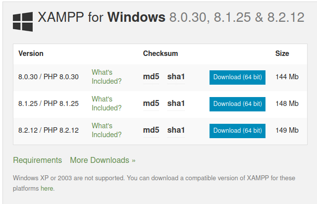
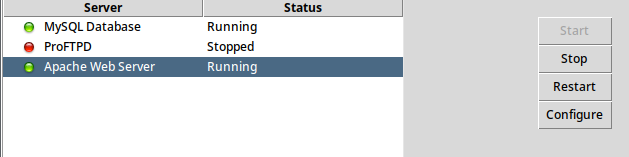

# **StudentManagementSystem**
___________
## Installation

### 1. Configure local webserver
1. Install [Xampp](https://www.apachefriends.org/download.html) 

2. Start Xampp and run Apache server and MySql Database 

4. Go to htdocs folder. (Usually located in: Windows - `C:\Xampp\htdocs`. Mac/Linux - `/opt/lampp/htdocs`.)

### 2. Clone using Git
1. Make sure [Git](https://git-scm.com/downloads) is installed (`git -v`)
2. Run `git clone https://github.com/sameepkat/StudentManagementSystem.git` inside htdocs folder.

### 3. Import database
1. Run `localhost/phpmyadmin` in any web-browser.
2. Create a datbase named `Software2080` (query: `CREATE DATABASE 'SOFTWARE2080'` and go inside that database.
3. Import the database provided in database folder in `StudentManagementSystem/database` folder.

### 4. LogIn
1. Log in using your SOE ID and Password provided by the college.

_________
## Contributing
1. Create a fork
2. Make necessary changes
3. Create a pull request. 

________
## Contributors
1. [Anil Pariyar](https://github.com/Aneel03)
2. [Bipana Ale](https://github.com/Bipanaale)
3. [Grish Rana](https://github.com/grishrana)
4. [Sameep Kathayat](https://github.com/sameepkat/)
5. [Suchita Baral](https://github.com/Suchitabaral)
